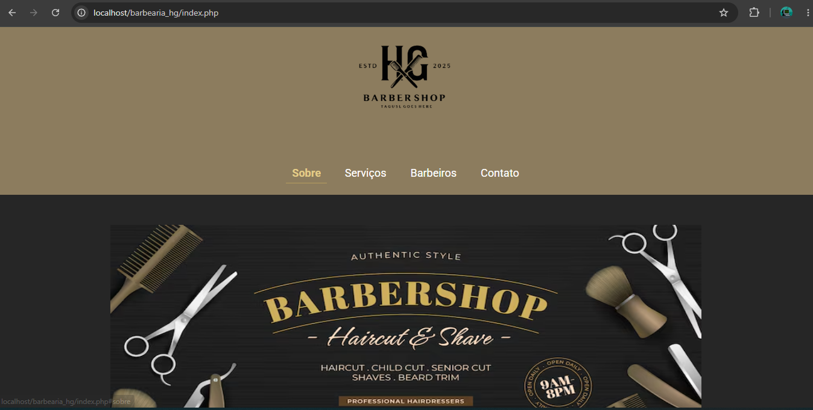
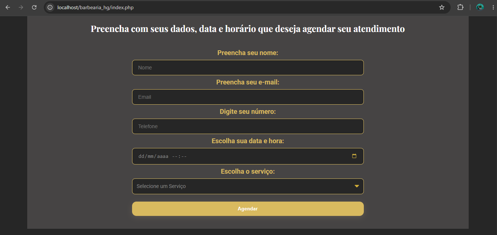
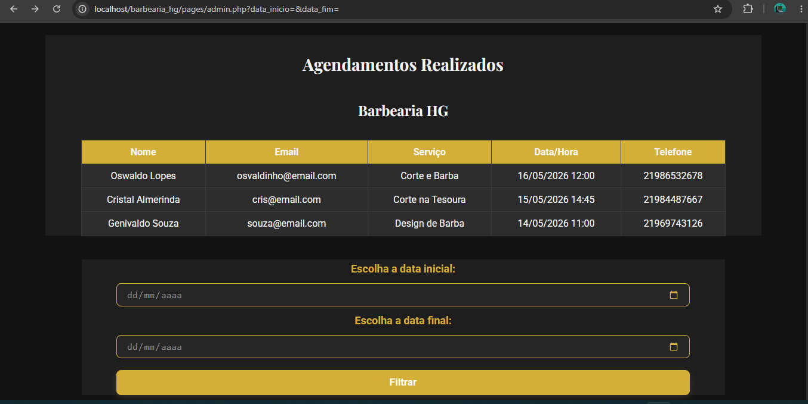
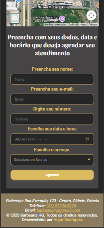
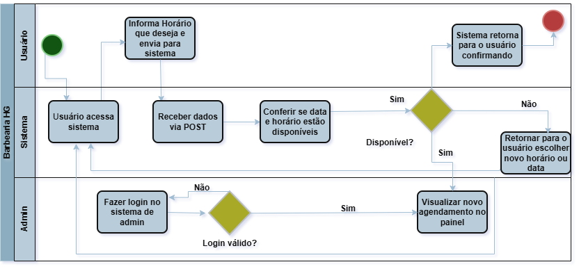

# Barbearia HG 💈

Sistema web de agendamento para barbearia desenvolvido como evolução de uma landing page autoral criada inicialmente para estudos de front-end.

O projeto foi expandido para uma aplicação full stack com PHP e MySQL, permitindo o gerenciamento de agendamentos e visualização administrativa dos atendimentos.

---

## Screenshots

## Página Inicial



## Formulário Agendamento



## Painel Administrativo



## Versão Mobile



## Modelagem do Processo



## 🚀 Funcionalidades

- Agendamento de horários
- Integração com banco de dados MySQL
- Painel administrativo
- Listagem de agendamentos
- Filtro por período
- Interface responsiva
- Estrutura organizada em pastas
- Uso de Prepared Statements com PDO
- Tratamento de dados e exibição dinâmica

---

## 📊 Documentação

O projeto possui uma modelagem inicial de fluxo utilizando BPMN, criada com foco em aprendizado de análise e modelagem de sistemas.

O diagrama representa o fluxo de agendamento, validação de disponibilidade e visualização administrativa do sistema.

### Fluxo Atual/Futuro do Sistema

- Usuário realiza agendamento
- Sistema recebe os dados via POST
- Verificação de disponibilidade de horário
- Envio para banco de dados
- Retorno de confirmação
- Visualização no painel administrativo

---

## 🛠 Tecnologias Utilizadas

### Front-end

- HTML5
- CSS3
- JavaScript

### Back-end

- PHP

### Banco de Dados

- MySQL

### Ferramentas

- Git
- GitHub
- VS Code
- MySQL Workbench

---

## 📂 Estrutura do Projeto

```bash id="jlwm8s"
Barbearia-HG/
│
├── assets/
│   ├── css/
│   ├── img/
│   └── js/
│
├── config/
│   └── conexao.php
│
├── database/
│   └── db_barbearia.sql
│
├── docs/
│   └── bpmn-barbearia.png
│
├── pages/
│   └── admin.php
│
├── index.php
├── README.md
└── .gitignore
```

---

## ⚙️ Como Executar o Projeto

### 1. Clone o repositório

```bash id="q5av2q"
git clone https://github.com/Higor-dev-rs/Barbearia-HG.git
```

### 2. Configure o ambiente

Necessário possuir:

- PHP
- MySQL
- XAMPP, WAMP ou Laragon

### 3. Importe o banco de dados

Importe o arquivo:

```bash id="jlwm9m"
database/db_barbearia.sql
```

### 4. Configure a conexão com o banco

No arquivo:

```bash id="mjlwm2"
config/conexao.php
```

altere as informações conforme seu ambiente local:

```php id="s2m1iz"
$host = "localhost";
$dbname = "nome_do_banco";
$usuario = "seu_usuario";
$senha = "sua_senha";
```

### 5. Execute o projeto

Coloque a pasta do projeto dentro do servidor local:

```bash id="jlwm2a"
htdocs/
```

e acesse:

```bash id="j2h9d1"
http://localhost/Barbearia-HG
```

---

## 📈 Melhorias Futuras

- Login administrativo
- Controle de sessões
- Validação de conflitos de horário
- Relacionamento entre tabelas
- Edição e exclusão de agendamentos
- Controle de barbeiros
- Status de agendamento
- Melhorias de UX/UI
- Refatoração e separação de responsabilidades

---

## 👨‍💻 Autor

Desenvolvido por Higor Rodrigues dos Santos.

[LinkedIn:](https://linkedin.com/in/higor-rodrigues-dev)

[GitHub:](https://github.com/Higor-dev-rs)
